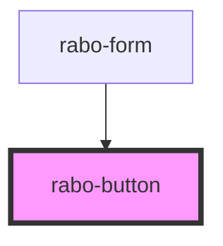

# rabo-button

<!-- Auto Generated Below -->

## Properties

| Property    | Attribute    | Description | Type                                           | Default               |
| ----------- | ------------ | ----------- | ---------------------------------------------- | --------------------- |
| `disabled`  | `disabled`   |             | `boolean`                                      | `false`               |
| `fullWidth` | `full-width` |             | `boolean`                                      | `false`               |
| `label`     | `label`      |             | `string`                                       | `undefined`           |
| `theme`     | `theme`      |             | `ButtonTheme.PRIMARY \| ButtonTheme.SECONDARY` | `ButtonTheme.PRIMARY` |
| `type`      | `type`       |             | `ButtonType.BUTTON \| ButtonType.SUBMIT`       | `ButtonType.BUTTON`   |

## Dependencies

### Used by

- [rabo-form](../rabo-form)

### Graph

---

_Built with [StencilJS](https://stenciljs.com/)_
