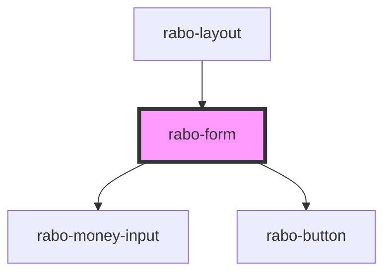

# rabo-form

<!-- Auto Generated Below -->

## Properties

| Property              | Attribute | Description | Type                                                                                                                     | Default     |
| --------------------- | --------- | ----------- | ------------------------------------------------------------------------------------------------------------------------ | ----------- |
| `schema` _(required)_ | --        |             | `{ type: InputTypes; name: string; required?: boolean; disabled?: boolean; validators?: Validator[]; hint?: string; }[]` | `undefined` |
| `value` _(required)_  | --        |             | `{ [x: string]: any; }`                                                                                                  | `undefined` |

## Events

| Event        | Description | Type                                 |
| ------------ | ----------- | ------------------------------------ |
| `formSubmit` |             | `CustomEvent<{ [x: string]: any; }>` |

## Dependencies

### Used by

 - [rabo-layout](../rabo-layout)

### Depends on

- [rabo-money-input](../rabo-money-input)
- [rabo-button](../rabo-button)

### Graph

----------------------------------------------

*Built with [StencilJS](https://stenciljs.com/)*
