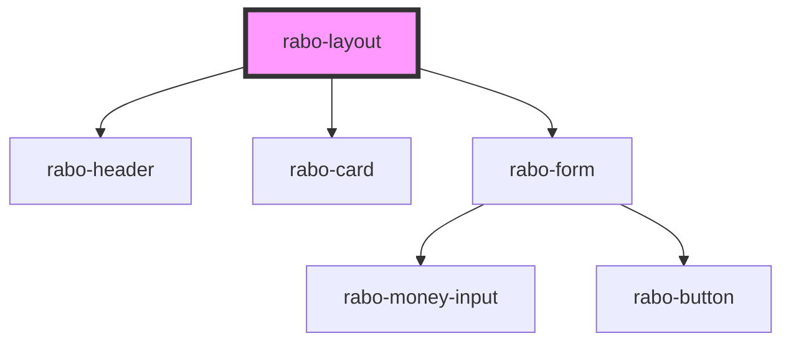

# rabo-layout

<!-- Auto Generated Below -->

## Dependencies

### Depends on

- [rabo-header](../rabo-header)
- [rabo-card](../rabo-card)
- [rabo-form](../rabo-form)

### Graph

---

_Built with [StencilJS](https://stenciljs.com/)_
