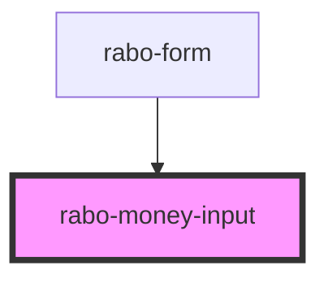

# rabo-money-input

<!-- Auto Generated Below -->

## Properties

| Property             | Attribute   | Description | Type                               | Default           |
| -------------------- | ----------- | ----------- | ---------------------------------- | ----------------- |
| `currency`           | `currency`  |             | `Currency.EUR \| Currency.USD`     | `Currency.EUR`    |
| `disabled`           | `disabled`  |             | `boolean`                          | `false`           |
| `error`              | `error`     |             | `string`                           | `undefined`       |
| `hint`               | `hint`      |             | `string`                           | `undefined`       |
| `label`              | `label`     |             | `string`                           | `'Amount'`        |
| `name` _(required)_  | `name`      |             | `string`                           | `undefined`       |
| `required`           | `required`  |             | `boolean`                          | `false`           |
| `separator`          | `separator` |             | `Separator.COMMA \| Separator.DOT` | `Separator.COMMA` |
| `value` _(required)_ | `value`     |             | `number`                           | `undefined`       |

## Events

| Event         | Description | Type                  |
| ------------- | ----------- | --------------------- |
| `valueChange` |             | `CustomEvent<number>` |

## Dependencies

### Used by

 - [rabo-form](../rabo-form)

### Graph

----------------------------------------------

*Built with [StencilJS](https://stenciljs.com/)*
